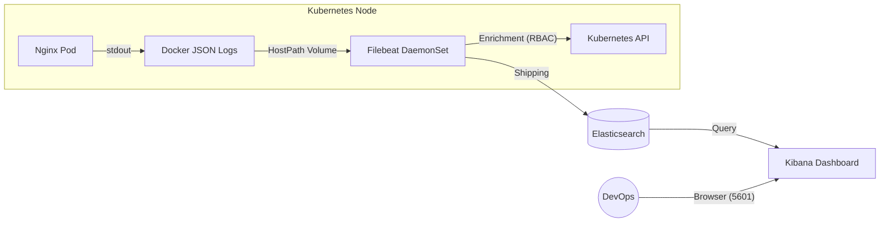

[Para PT-BR, clique aqui](#índice)

# ☸️ Kubernetes Native ELK Stack (Log Observability)


## Index

- [📋 About the Project](#-about-the-project)
- [🏗️ Architecture and Data Flow](#architecture)
- [🐳 Implementation 1: Docker (Local/Legacy)](#-implementation-1-docker-locallegacy)
- [☸️ Implementation 2: Kubernetes (Cloud Native)](#kubernetes)
  - [1. Security and Access (rbac.yaml)](#1-security-and-access-rbacyaml)
  - [2. The Collector Agent (filebeat-daemonset.yaml)](#2-the-collector-agent-filebeat-daemonsetyaml)
  - [3. Database (elasticsearch.yaml)](#3-database-elasticsearchyaml)
  - [4. Application (nginx-app.yaml)](#4-application-nginx-appyaml)
  - [5. Interface (kibana.yaml)](#5-interface-kibanayaml)
- [🚀 How to run](#-how-to-run)
- [🧪 Validation: Chaos Testing](#-validation-chaos-testing)
- [📂 File Structure](#-file-structure)
- [Detailed Data Flow](#detailed-data-flow)

## 📋 About the Project

This project implements a complete **Log Observability** solution running natively on Kubernetes.

The goal is to demonstrate the collection, processing and visualization of distributed application logs using the **ELK Stack (Elasticsearch, Logstash/Filebeat, Kibana)**, migrating from a local approach (Docker Compose) to container orchestration with K8s manifests, focusing on patterns such as **DaemonSets** and **RBAC**.

---

<a name="architecture"></a>
## 🏗️ Architecture and Data Flow

The architecture follows the **Log Harvesting** pattern using DaemonSets to ensure that each cluster node has a log collector.



## 🐳 Implementation 1: Docker (Local/Legacy)

The initial version of the project uses `docker-compose` to understand the basic components.

### Data Flow (Docker)

1. **Generation:** The container `webserver` (Nginx) receives requests and writes logs to standard output (stdout).

2. **Exposure:** Docker exposes these logs and the control socket via host volumes.

3. **Collection (Filebeat):**
   - *Input:* Filebeat scans `/var/lib/docker/containers` looking for `.log` files.
   - *Processing:* Queries `docker.sock` to discover the container's real name and image.
   - *Output:* Sends enriched data to the container `elasticsearch:9200`.

4. **Visualization:** The container `kibana` accesses elasticsearch to display data in the browser.

<a name="kubernetes"></a>
## ☸️ Implementation 2: Kubernetes (Cloud Native)

The evolution of the project to Kubernetes introduces orchestration, security and service discovery concepts. Below are the technical details of each manifest:

### 1. Security and Access (rbac.yaml)

- **Identity:** The Filebeat Pod uses its own `ServiceAccount`.

- **Request:** It attempts to connect to the K8s API to retrieve pod metadata (Name, Namespace).

- **Authorization:** Kubernetes checks the `ClusterRoleBinding` and  `ClusterRole`, confirming Filebeat has read permission(`get`, `list`, `watch`) on pods and nodes.

### 2. The Collector Agent (filebeat-daemonset.yaml)

- **DaemonSet:** Ensures one Filebeat pod per node.

- **HostPath:** Kubernetes generates a symbolic link in `/var/log/containers` pointing to Docker logs. Filebeat mounts this volume to read the host's disk.

- **Enrichment:** Consults K8s API using `NODE_NAME` to correlate the raw log with the correct Pod before sending it to Elasticsearch.

### 3. Database (elasticsearch.yaml)

- **Scheduling:** K8s schedules the Pod and applies RAM limits to protect the node.

- **Discovery:** The `Service` object creates an internal DNS (`elasticsearch`). Any traffic to `elasticsearch:9200` within the cluster is routed to this Pod.

### 4. Application (nginx-app.yaml)

- **Load Balancing:** The Service receives traffic on port 80 and distributes it among replicas.

- **Logging:** Pods generate logs via `stdout`, which are silently captured by Docker on the Node's disk, awaiting collection by Filebeat.

### 5. Interface (kibana.yaml)

- **Connection:** The Pod starts, reads the `ELASTICSEARCH_URL` variable and connects to the internal database.

- **Exposition:** A `LoadBalancer` Service opens the external port `5601`, allowing dashboard access via browser.

## 🚀 How to run

### Prerequisits

- Docker, `kubectl` and **k3d** (for a lightweight local cluster).

### 1. Create the Cluster

```bash
# Create a cluster mapping Nginx port (8080) and Kibana port (5601)
k3d cluster create elk-cluster -p "8080:80@loadbalancer" -p "5601:5601@loadbalancer"
```

### 2. Apply Manifests (in this order)

```bash
# 1. Security (RBAC)
kubectl apply -f kubernetes/rbac.yaml

# 2. Database and Interface
kubectl apply -f kubernetes/elasticsearch.yaml
kubectl apply -f kubernetes/kibana.yaml

# 3. Log Agent (ConfigMap + DaemonSet)
kubectl apply -f kubernetes/filebeat-daemonset.yaml

# 4. Log Generator App
kubectl apply -f kubernetes/nginx-app.yaml
```

### 3. Verification

Wait for the pods to reach `Running` status:

```bash
kubectl get pods -w
```

## 🧪 Validation: Chaos Testing

To prove the architecture's resilience, I performed a manual failure test:

1. **Generate Traffic:** Access `http://localhost:8080` (Nginx) and refresh the page several times.

2. **The Chaos:** Manually delete one of the Nginx pods:
```bash
kubectl delete pod -l app=nginx
```
3. **Result:**
- Kubernetes immediatly provisions a new pod.
- In **Kibana** (`http://localhost:5601`), filtering by `kubernetes.pod.name`, you'll see old the pod's logs stop and the new pod's logs start instantly, with no data loss.

## 📂 File Structure
```text
.
├── docker/                 # Legacy files (docker-compose)
├── kubernetes/
│   ├── elasticsearch.yaml  # Database (Single-Node)
│   ├── kibana.yaml         # Web Interface
│   ├── filebeat-daemonset.yaml # Collector Agent + ConfigMap
│   ├── rbac.yaml           # API Access Permissions
│   └── nginx-app.yaml      # Example App
└── README.md
```

---

## Detailed Data Flow

DOCKER

docker-compose.yml

1. The container `webserver` (Nginx) receives requests and writes logs in the standard output.
2. Docker (locally) exposes these logs and the control socket via host volumes.
3. The filebeat container starts, mounts these volumes and reads Nginx logs directly from the host disk.
4. Filebeat sends this data through the internal network (elk-net) to the elasticsearch container.
5. The container `kibana` accesses elasticsearch (also via elk-net) to display data in the browser.

filebeat.yaml

1. Input: Filebeat scans `/var/lib/docker/containers` looking for `.log` files.
2. Processing: When it finds a log, it queries the Docker socket (docker.sock) to find the real name and image of the container that generated it.
3. Output: Filebeat packages the information and sends it to the network address `elasticsearch:9200`.
4. Setup: (Optional) Filebeat connects to kibana:5601 only to create the initial visual dashboards.

---

KUBERNETES

elasticsearch.yaml

1. Kubernetes schedules Elasticsearch Pod and applies RAM limits so the container won't crash the node.
2. The container starts and configures itself as a single-node, without searching for peers.
3. The Service object generates an internal DNS name called `elasticsearch`.
4. Any traffic sent to `elasticsearch:9200` inside the cluster is redirected to this Pod.

filebeat-daemonset.yaml

1. The applications generates a log (stdout).
2. Docker saves it in a JSON file in /var/lib/docker/containers on the server.
3. Kubernetes creates a symbolic link in /var/log/containers.
4. Filebeat (running as root via DaemonSet) reads this file through volume hostPath.
5. Filebeat queries the K8s API using NODE_NAME to discover the Pod name.
6. Filebeat sends the enriched log to Elasticsearch.

kibana.yaml

1. The Kibana Pod starts and reads the ELASTICSEARCH_URL variable.
2. It uses this URL to establish a connection with the internal database (Elasticsearch).
3. The Service object (type LoadBalancer) opens an external port in the cluster.
4. When you access the external IP on port 5601, the Service forwards your request to the Pod, which fetches data from Elasticsearch and returns the visual interface.

nginx-app.yaml

1. The Service (type LoadBalancer) receives external traffic on port 80 and distributes between the 2 replicas.
2. Nginx Pods process the request and generate access logs to standard output (stdout).
3. Kubernetes/Docker silently writes these logs in the Node's disk (which will be read later by Filebeat, configured in the DaemonSet).

rbac.yaml

1. Identity: The Filebeat Pod starts and identifies itself to Kubernetes using ServiceAccount "filebeat" (defined in this file and referenced in the DaemonSet).
2. Request: Filebeat attempts to connect to the Kubernetes API to ask: "What it the real name of the pod with ID xyd?" (this is the metadata processor running).
3. Binding: Kubernetes intercepts the request and checks the ClusterRoleBinding. It sees the ServiceAccount "filebeat" is bound to the rules of the role "filebeat".
4. Role: Kubernetes reads the ClusterRole to verify if the action is allowed.
5. Permission: The rule confirms that the action (get, list, watch) on the resources (pods, nodes, namespaces) is allowed.
6. Result: The Kubernetes API delivers the data to Filebeat, allowing the it to enrich logs with names and labels.

---

PT-BR

## Índice

- [📋 Sobre o Projeto](#-sobre-o-projeto)
- [🏗️ Arquitetura e Fluxo de Dados](#arquitetura)
- [🐳 Implementação 1: Docker (Local/Legacy)](#-implementação-1-docker-locallegacy)
- [☸️ Implementação 2: Kubernetes (Cloud Native)](#kubernetes)
  - [1. Segurança e Acesso (rbac.yaml)](#1-segurança-e-acesso-rbacyaml)
  - [2. O Agente Coletor (filebeat-daemonset.yaml)](#2-o-agente-coletor-filebeat-daemonsetyaml)
  - [3. Banco de Dados (elasticsearch.yaml)](#3-banco-de-dados-elasticsearchyaml)
  - [4. Aplicação (nginx-app.yaml)](#4-aplicação-nginx-appyaml)
  - [5. Interface (kibana.yaml)](#5-inter-face-kibanayaml)
- [🚀 Como Rodar](#-como-rodar)
- [🧪 Validação: Teste de Caos](#-validação-teste-de-caos)
- [📂 Estrutura de Arquivos](#-estrutura-de-arquivos)
- [Fluxo de dados](#fluxo-de-dados)

## 📋 Sobre o Projeto

Este projeto implementa uma solução completa de **Observabilidade de Logs** rodando nativamente em Kubernetes.

O objetivo é demonstrar a coleta, processamento e visualização de logs de aplicações distribuídas utilizando a **ELK Stack (Elasticsearch, Logstash/Filebeat, Kibana)**, migrando de uma abordagem local (Docker Compose) para orquestração de containers com manifestos K8s, focando em padrões como **DaemonSets** e **RBAC**.

---

<a name="arquitetura"></a>
## 🏗️ Arquitetura e Fluxo de Dados

A arquitetura segue o padrão de **Log Harvesting** utilizando DaemonSets para garantir que cada nó do cluster tenha um coletor de logs.


## 🐳 Implementação 1: Docker (Local/Legacy)

A versão inicial do projeto utiliza `docker-compose` para entendimento dos componentes básicos.

### Fluxo de Dados (Docker)

1. **Geração:** O container `webserver` (Nginx) recebe acessos e escreve logs na saída padrão.

2. **Exposição:** O Docker expõe esses logs e o socket de controle via volumes no host.

3. **Coleta (Filebeat):**
   - *Input:* O Filebeat varre `/var/lib/docker/containers` procurando arquivos `.log`.
   - *Processamento:* Consulta o `docker.sock` para descobrir o nome real e a imagem do container.
   - *Output:* Envia os dados enriquecidos para o container `elasticsearch:9200`.

4. **Visualização:** O container `kibana` acessa o elasticsearch para exibir os dados no navegador.

<a name="kubernetes"></a>
## ☸️ Implementação 2: Kubernetes (Cloud Native)

A evolução do projeto para Kubernetes introduz conceitos de orquestração, segurança e service discovery. Abaixo, o detalhamento técnico de cada manifesto:

### 1. Segurança e Acesso (rbac.yaml)

- **Identidade:** O Pod do Filebeat usa uma `ServiceAccount` própria.

- **Solicitação:** Ele tenta conectar na API do K8s para perguntar os metadados do pod (Nome, Namespace).

- **Autorização:** O Kubernetes verifica a `ClusterRoleBinding` e a `ClusterRole`, confirmando que o Filebeat tem permissão de leitura (`get`, `list`, `watch`) sobre pods e nodes.

### 2. O Agente Coletor (filebeat-daemonset.yaml)

- **DaemonSet:** Garante um pod do Filebeat por nó.

- **HostPath:** O Kubernetes cria um link simbólico em `/var/log/containers` apontando para os logs do Docker. O Filebeat monta esse volume para ler o disco do host.

- **Enriquecimento:** Consulta a API do K8s usando o `NODE_NAME` para correlacionar o log bruto com o Pod correto antes de enviar ao Elasticsearch.

### 3. Banco de Dados (elasticsearch.yaml)

- **Scheduling:** O K8s agenda o Pod e aplica limites de RAM para proteção do nó.

- **Discovery:** O objeto `Service` cria um DNS interno (`elasticsearch`). Qualquer tráfego para `elasticsearch:9200` dentro do cluster é roteado para este Pod.

### 4. Aplicação (nginx-app.yaml)

- **Load Balancing:** O Service recebe tráfego na porta 80 e distribui entre as réplicas.

- **Logging:** Os Pods geram logs em `stdout`, que são capturados silenciosamente pelo Docker no disco do Nó, aguardando a coleta do Filebeat.

### 5. Inter face (kibana.yaml)

- **Conexão:** O Pod inicia, lê a variável `ELASTICSEARCH_URL` e conecta no banco interno.

- **Exposição:** Um Service do tipo `LoadBalancer` abre a porta externa `5601`, permitindo acesso ao dashboard via navegador.

## 🚀 Como Rodar

### Pré-requisitos

- Docker, `kubectl` e **k3d** (para cluster local leve).

### 1. Criar o Cluster

```bash
# Cria cluster mapeando portas do Nginx (8080) e Kibana (5601)
k3d cluster create elk-cluster -p "8080:80@loadbalancer" -p "5601:5601@loadbalancer"
```

### 2. Aplicar Manifestos (Na ordem)

```bash
# 1. Segurança (RBAC)
kubectl apply -f kubernetes/rbac.yaml

# 2. Banco de Dados e Interface
kubectl apply -f kubernetes/elasticsearch.yaml
kubectl apply -f kubernetes/kibana.yaml

# 3. Agente de Logs (ConfigMap + DaemonSet)
kubectl apply -f kubernetes/filebeat-daemonset.yaml

# 4. Aplicação Geradora de Logs
kubectl apply -f kubernetes/nginx-app.yaml
```

### 3. Verificar

Aguarde os pods ficarem `Running`:

```bash
kubectl get pods -w
```

## 🧪 Validação: Teste de Caos

Para provar a resiliência da arquitetura, realizei um teste de falha manual:

1. **Gere Tráfego:** Acesse `http://localhost:8080` (Nginx) e atualize a página várias vezes.

2. **O Caos:** Delete manualmente um dos pods do Nginx:
```bash
kubectl delete pod -l app=nginx
```
3. **Resultado:**
- O Kubernetes sobe um novo pod imediatamente.
- No **Kibana** (`http://localhost:5601`), ao filtrar por `kubernetes.pod.name`, você verá os logs do pod antigo cessarem e os do novo pod começarem instantaneamente, sem perda de dados.

## 📂 Estrutura de Arquivos
```text
.
├── docker/                 # Arquivos legado (docker-compose)
├── kubernetes/
│   ├── elasticsearch.yaml  # Banco de Dados (Single-Node)
│   ├── kibana.yaml         # Interface Web
│   ├── filebeat-daemonset.yaml # Agente de coleta + ConfigMap
│   ├── rbac.yaml           # Permissões de acesso à API
│   └── nginx-app.yaml      # App Exemplo
└── README.md
```

---

## Fluxo de dados

DOCKER

docker-compose.yml

1. O container webserver (Nginx) recebe acessos e escreve logs na saída padrão.
2. O Docker (no seu computador) expõe esses logs e o socket de controle via volumes.
3. O container filebeat inicia, monta esses volumes e lê os logs do Nginx direto do disco do seu computador.
4. O filebeat envia esses dados pela rede interna elk-net para o container elasticsearch.
5. O container kibana acessa o elasticsearch (também via elk-net) para exibir os dados no navegador.

filebeat.yaml

1. Input: O Filebeat varre a pasta /var/lib/docker/containers procurando arquivos .log.
2. Processamento: Ao achar um log, ele consulta o socket do Docker (docker.sock) para descobrir o nome real e a imagem do container que gerou aquele log.
3. Output: O Filebeat empacota essas informações e envia para o endereço de rede elasticsearch:9200.
4. Setup: (Opcional) O Filebeat conecta no kibana:5601 apenas para criar os painéis visuais iniciais.

---

KUBERNETES

elasticsearch.yaml

1. O Kubernetes agenda o Pod do Elasticsearch e aplica limites de memória (RAM) para o container não travar o nó.
2. O container sobe e se configura como um nó único (single-node), sem procurar outros parceiros.
3. O objeto Service cria um DNS interno chamado elasticsearch.
4. Qualquer tráfego enviado para elasticsearch:9200 dentro do cluster é redirecionado para este Pod.

filebeat-daemonset.yaml

1. Sua aplicação escreve um log (stdout).
2. O Docker salva isso num arquivo JSON em /var/lib/docker/containers no servidor.
3. O Kubernetes cria um link simbólico em /var/log/containers.
4. O Filebeat (rodando como root via DaemonSet) lê esse arquivo através do volume hostPath.
5. O Filebeat consulta a API do K8s usando o NODE_NAME para descobrir o nome do Pod.
6. O Filebeat envia o log enriquecido para o Elasticsearch.

kibana.yaml

1. O Pod do Kibana inicia e lê a variável ELASTICSEARCH_URL.
2. Ele usa essa URL para estabelecer conexão com o banco de dados (Elasticsearch) interno.
3. O objeto Service (tipo LoadBalancer) abre uma porta externa no cluster.
4. Quando você acessa o IP externo na porta 5601, o Service encaminha sua requisição para o Pod, que busca os dados no Elasticsearch e devolve a tela visual.

nginx-app.yaml

1. O objeto Service (tipo LoadBalancer) recebe tráfego externo na porta 80 e distribui entre as 2 réplicas.
2. Os Pods do Nginx processam a requisição e geram logs de acesso na saída padrão (stdout).
3. O Kubernetes/Docker grava esses logs silenciosamente no disco do Nó (que serão lidos posteriormente pelo Filebeat, configurado no outro arquivo).

rbac.yaml

1. Identidade: O Pod do Filebeat inicia e se apresenta ao Kubernetes usando a ServiceAccount "filebeat" (definida neste arquivo e referenciada no DaemonSet).
2. Solicitação: O Filebeat tenta conectar na API do Kubernetes para perguntar: "Qual é o nome real do pod com ID xyz?" (isso é o processador de metadados rodando).
3. Vínculo (Binding): O Kubernetes intercepta o pedido e consulta a ClusterRoleBinding. Ele vê que a ServiceAccount "filebeat" está ligada às regras da role "filebeat".
4. Regras (Role): O Kubernetes lê a ClusterRole para verificar se a ação é permitida.
5. Permissão: A regra confirma que a ação (get, list, watch) nos recursos (pods, nodes, namespaces) está liberada.
6. Resultado: A API do Kubernetes entrega os dados para o Filebeat, permitindo que ele enriqueça os logs com nomes e labels reais.